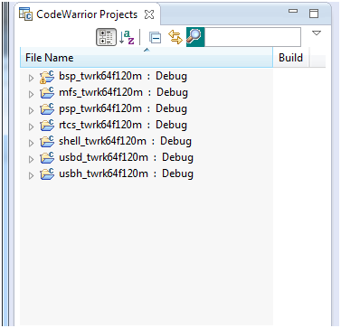

Build In Code Warrior
=====================

## Install the Build Tools

  1. Install Code Warrior (CodeWarrior for MCU 11.1)
  2. Open Code Warrior IDE

## Checkout the repository

  `git clone https://github.com/legrand-home-systems-mdt/LCM.git --recursive`

## Build the Board Support Packages

  1. `File` > `Import` > `Other` > `Import Working Sets`
     * Choose - `LCM\MQX\build\twrk64f120m\cw10gcc\build_libs.wsd`
     * 
  2. Build all of the libraries by selecting `Project` > `Build All`

## Build the LCM Project

  1. Import the LCM project into the workspace
     * `File` > `Import` > `General` > `Import Existing Projects into Workspace`
     * Select the **LCM** folder and check the boxes for:
        1. `LCM1-git`
        2. `wolfssl`
        3. `wolfmqtt`

  2. Fix MQX Paths
     * Right click **LCM1-git** project, and select `properties`
       * `Resource` > `Linked Resources` > Edit `MQX_ROOT_DIR` to be `${PROJECT_LOC}\..\MQX`
     * Right click **wolfmqtt** project, and select `properties`
       * `Resource` > `Linked Resources` > Edit `MQX_ROOT_DIR` to be `${PROJECT_LOC}\..\MQX`
     * Right click **wolfssl** project, and select `properties`
       * `Resource` > `Linked Resources` > Edit `MQX_ROOT_DIR` to be `${PROJECT_LOC}\..\..\..\..\MQX`
     * **NOTE:** Make sure `Copy projects into workspace` is **NOT** Checked

  3. Set Project References
     * Right click **LCM1-git** project, and select `properties`
     * In `Project References` Check the boxes for:
         1. wolfmqtt
         2. wolfssl

  4. Build **LCM1-git** by right clicking on the `LCM1-git` project and selecting `Build Project`
