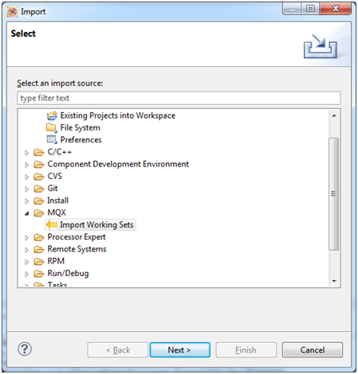
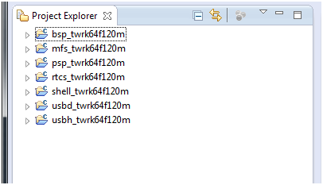
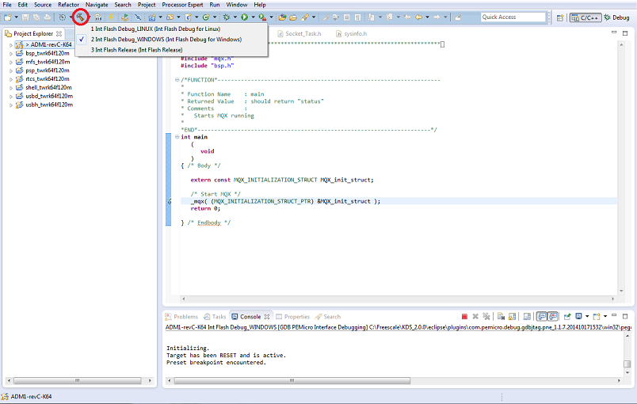

Build In Kinetis Design Studio
==============================
For purposes of this document the following variables are defined:

## Install the Build Tools
1. [Install Kinetis Design Studio](InstallKDS.md)
2. Open the KDS IDE by clicking on the Desktop Icon

## Checkout the repository
1. <code>git clone https://github.com/legrand-home-systems-mdt/LCM.git</code>

## Build the Board Support Packages
1. Import the working sets by navigating to <code>File > Import > MQX > Import Working Sets</code>

2. Browse to the file in the repository LCM/MQX/build/twrk64f120m/kds/build_libs.wsd to import the working sets

3. Build all of the libraries by selecting Project > Build All

## Build the LCM Project
1. Copy `.cproject_kds` to `.cproject` in the main project directory to ensure that the kinetis design studio project file is used
2. Import the LCM project into the workspace
    * `File > Import > General > Import Existing Projects into Workspace`
    * Select the directory containing the project and ensure that you do 
      **NOT** select Copy projects into workspace
3. Ensure the correct build configuration is selected by clicking on the arrow
   next to the hammer icon 

