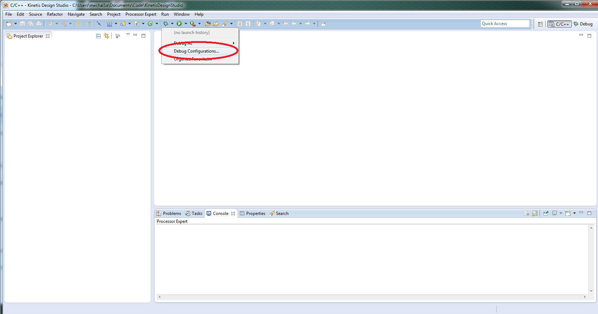
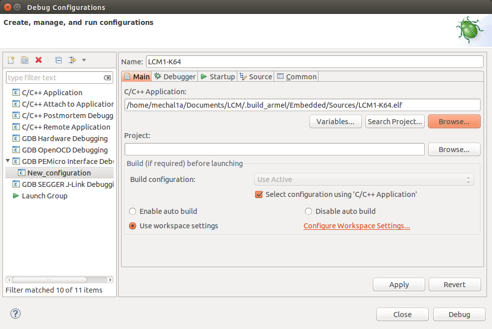
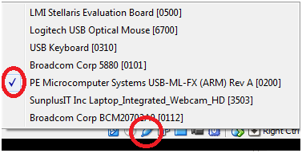
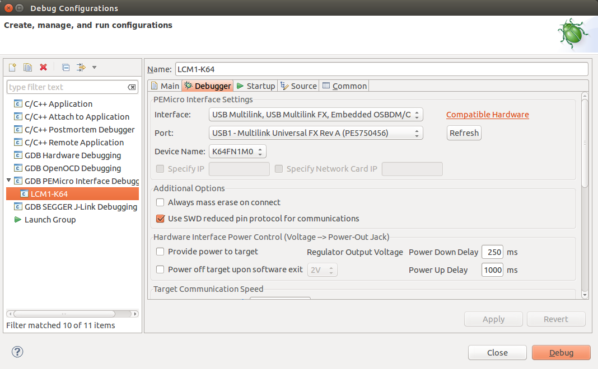

Debug In Kinetis Design Studio
==============================
After [Building in KDS](BuildInKDS.md) or 
[Building in Cmake](BuildUsingCmake.md), the LCM is able to be debugged. These
instructions assume it is using a PEMicro debugging interface

1. Click on the arrow next to the debug icon and select debug configurations
   to create a new debug configuration

2. On the popup, double click on the GDB PEMicro Interface Debugging to create a new debug configuration
3. In the Main tab
    * Select browse to find the C/C++ application and select the .elf file that
      was just built
    * Keep all of the other options as the default

4. In the Debugger tab
    * Select the SUB Multilink, USB Multilink FX, Embedded OSBDM/OSJTAG - USB Port for the interface
    * Select the correct port for the USB device
        * If nothing appears in the list for the linux virtual machine, you may
          have to allow the port through the virtual machine. This is done by
          selecting the USB icon and clicking on the PE Microcomputer systems
          device. Once that is done, hit refresh on the configurations screen
          to view the available port and select it.
          
    * Select K64FN1M0M12 for the device name
    * Use defaults for all of the other parameters

    
