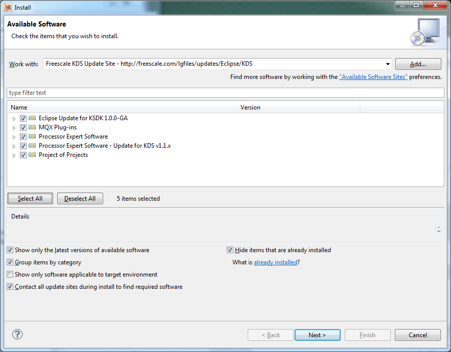

Install Kinetis Design Studio
=============================

## Install KDS
1. Download [Kinetis Design Studio IDE](http://www.freescale.com/webapp/sps/site/prod_summary.jsp?code=KDS_IDE)
2. Install the IDE
    * Double click on the downloaded .exe (.deb for Linux) and follow the 
      onscreen prompts 

## Launch the application
* Linux
    * Create the launcher for KDS by creating a new file on the Desktop that contains the following and save it as kinetis_design_studio.desktop
    <pre>
    [Desktop Entry]
    Encoding=UTF-8
    Version=1.0
    Type=Application
    Name=C/C++ - Kinetis Design Studio
    Icon=kinetis_design_studio.png
    Path=/home/developer
    Exec=gksu /opt/Freescale/KDS_2.0.0/eclipse/kinetis-design-studio
    StartupNotify=true
    StartupWMClass=Kinetis Design Studio
    </pre>
* Windows
    * Double click on the desktop icon to launch the application

## Install MQX in Kinetis Design Studio
1. Open the software installer in the KDS IDE
    * <code>Help > Install New Software</code>
2. Select **Freescale KDS Update Site** in the Work with: block
3. Click `Select All` to select all of the software updates

4. Click Next to Install the updates
