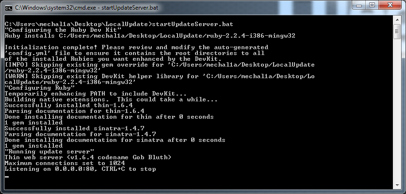
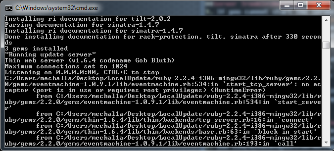
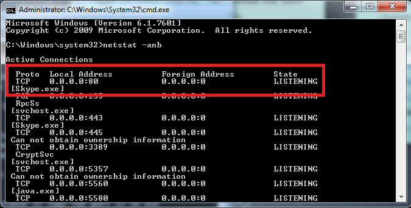
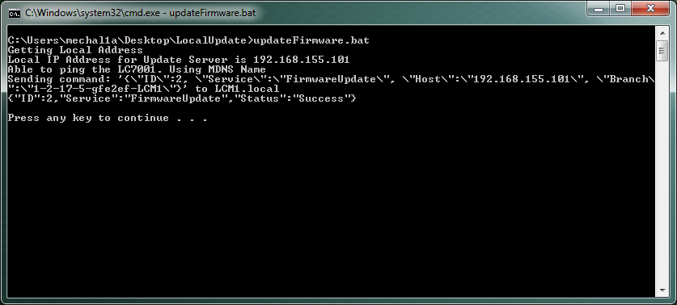

#1. Install and Run Update Server on Windows
1. Extract DevKit-mingw64-32-4.7.2-20130224-1151-sfx.exe to LCM/WindowsUpdateServer/DevKit
2. Extract nmap-7.01-win32.zip to LCM/WindowsUpdateServer/nmap7.01-win32
3. Extract ruby-2.24-i386-mingw32.7z to LCM/WindowsUpdateServer/ruby-2.24-i386-mingw32
4. Clone the Release Directory from herokuapp to LCM/WindowsUpdateServer/Releases
    * `heroku login`
    * `heroku git:clone -a legrand-lcm LCM/WindowsUpdateServer/Releases`
5. Run `startUpdateServer.bat` from a windows command prompt. When finished installing, you should see the following output showing that it is running
6. Successful output

##Server Troubleshooting
1. If you cannot start the server because it says the port is in use

   1. Determine which application is using the port
      * Open a command prompt with administrator rights
      * Run the command `netstat -anb` and look for anything that is using port 80.
        
      * Close the application that is using the port and try again
   2. If the application appears to be a windows process see this [link](https://www.devside.net/wamp-server/opening-up-port-80-for-apache-to-use-on-windows) for more details
      * Open a command prompt with administrator rights
      * Run the command `net stop http /y` to stop the windows http proxy service and try again

#2. Update the LC7001 from the local machine
1. Ensure that the LC7001 and the Windows Update Server are on the same network and the update server is up and running
2. Run `updateFirmware.bat` in a second windows command prompt
3. You should see successful output in this screen and an update on the prompt running the server that it was accessed

##Update Script Troubleshooting
1. If the script appears to run but does not show the successful output, the ncat executable might not be able to run because of a missing windows DLL.
   * From the command prompt, enter `nmap-7.01-win32\nmap-7.01\ncat.exe` to run the ncat application. If you get the following error, then you need to install the correct DLL to use for execution
     
   * If it is a 64 bit system, move the file in DLLs/64bit/msvcr120.dll to the top level directory where the scripts are located.
   * If it is a 32 bit system, move the file in DLLs/32bit/msvcr120.dll to the top level directory where the scripts are located.
   * After doing this, you should be able to run ncat and then the script should work properly
